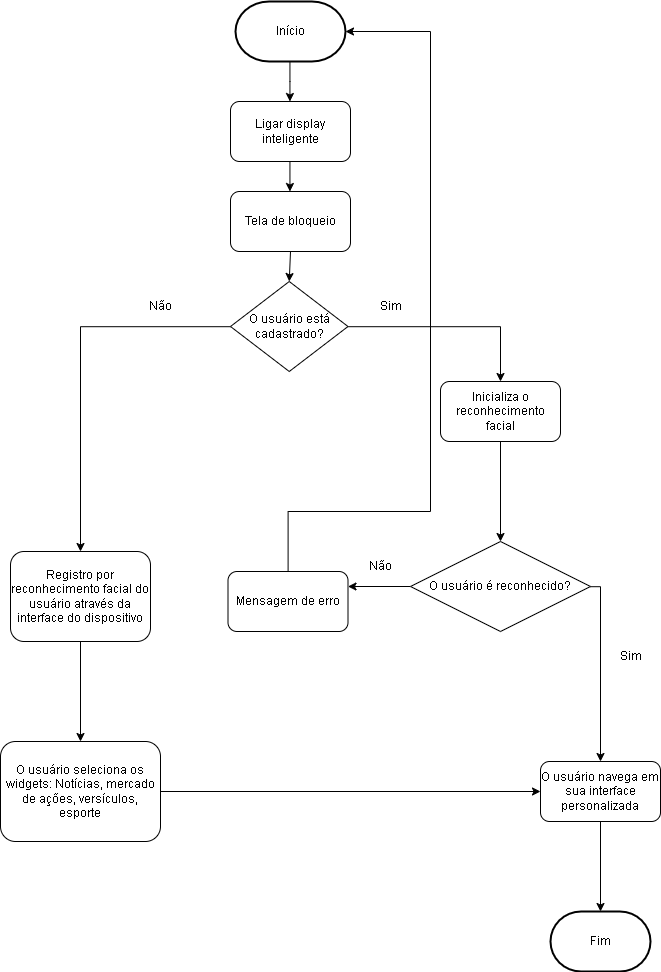
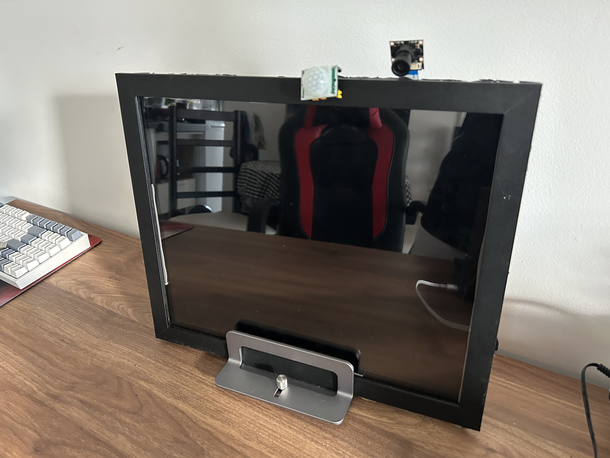

# Espelho Inteligente com Assistente Virtual e Reconhecimento Facial

Projeto acadêmico desenvolvido na Universidade Tecnológica Federal do Paraná (UTFPR) para a disciplina de **Oficinas de Integração 1**, com o objetivo de integrar hardware e software em um dispositivo de uso cotidiano, elevando a experiência de um espelho tradicional por meio de tecnologias de **IoT**, **Inteligência Artificial**, **Reconhecimento Facial** e **Comando de Voz**.

---

## Funcionalidades

- Assistente virtual personalizada (Zoey) com integração via API da OpenAI.
- Interação por comando de voz com transcrição automática.
- Reconhecimento facial para autenticação e interface personalizada.
- Exibição de informações em tempo real: data, hora, clima, notícias, ações, placares esportivos e versículos bíblicos.
- Ativação automática da interface por sensor de movimento (HC-SR501).
- Leitura de temperatura e umidade com sensor DHT11.

---

## Tecnologias Utilizadas

### **Hardware**
- Raspberry Pi 3B+
- Sensor de movimento HC-SR501
- Sensor de temperatura e umidade DHT11
- Câmera (para reconhecimento facial)
- Microfone (para entrada de voz)
- Monitor LCD + vidro com insulfilm (espelho bidirecional improvisado)
- Moldura touch

### **Software**
- `Python 3.11` (backend)
- `OpenCV` (reconhecimento facial)
- `SpeechRecognition` + `ChatGPT API` (comando de voz e assistente virtual)
- `FastAPI` (servidor de backend)
- `HTML`, `CSS`, `JavaScript` (frontend/interface)
- `SQLite` (banco de dados local leve)
- APIs externas: NewsAPI, InfoMoney, BibliaOn, CNNBrasil

---

## Inteligência Artificial

- A assistente virtual **Zoey** foi implementada usando a API da OpenAI (modelo GPT-4-o-mini).
- Capaz de interagir com o usuário por voz, responder perguntas, fornecer notícias e até manter diálogos simples.
- A personalidade e o comportamento da Zoey foram customizados para garantir uma experiência única no contexto do espelho inteligente.

---

## Reconhecimento Facial

- Implementado com `OpenCV` e o algoritmo **LBPH (Local Binary Patterns Histograms)**.
- Cada usuário possui um perfil único, com widgets personalizados e autenticação baseada na similaridade facial (>60% de precisão).
- O sistema armazena os dados faciais com segurança em banco local e carrega a interface apenas para usuários reconhecidos.

---

## Resultados e Conclusões

- Sistema funcional com todas as funcionalidades planejadas implementadas com sucesso.
- Reconhecimento facial robusto e seguro.
- Interface intuitiva e responsiva.
- Sensor de movimento altamente confiável.
- A única limitação foi o espelho improvisado com insulfilm, que não alcançou o mesmo nível de reflexividade de um espelho bidirecional profissional.

---

## Créditos

Desenvolvido por:
- Mateus Silva
- Lucas de Morais
- William de Morais Chakur

**Universidade Tecnológica Federal do Paraná – UTFPR**  
Curso: Engenharia da Computação

---

## Imagens do Projeto

  

<em>Figura 1: Diagrama do Smart Mirror</em>

  

<em>Figura 2: Espelho inteligente em funcionamento</em>

  

<em>Figura 3: Interface do usuário</em>

## Vídeo do projeto

O vídeo do projeto em funcionamento pode ser acessado publicamente no [youtube](https://www.youtube.com/watch?v=5a-c2_L6kec) 

---

## Futuras Melhorias

- Substituir vidro com insulfilm por espelho bidirecional real.
- Melhor acabamento físico da estrutura do espelho.
- Interface via aplicativo mobile para configuração remota.

---
