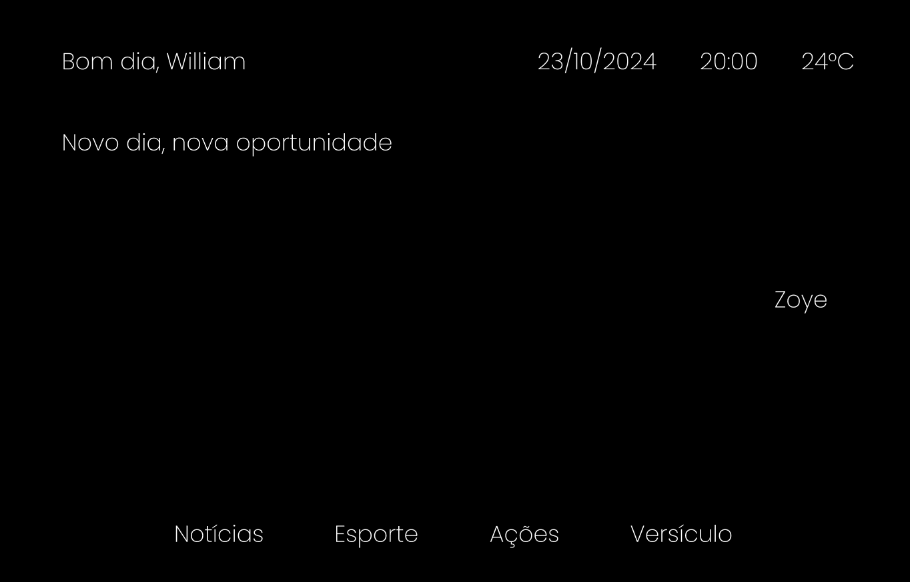

# Smart Mirror with Virtual Assistant and Facial Recognition

Academic project developed at the Federal University of Technology - Paraná (UTFPR) for the **Integration Workshop 1** course, with the objective of integrating hardware and software in an everyday device, enhancing the experience of a traditional mirror through **IoT**, **Artificial Intelligence**, **Facial Recognition** and **Voice Command** technologies.

---

## Features

- Personalized virtual assistant (Zoey) with OpenAI API integration.
- Voice command interaction with automatic transcription.
- Facial recognition for authentication and personalized interface.
- Real-time information display: date, time, weather, news, stocks, sports scores and bible verses.
- Automatic interface activation by motion sensor (HC-SR501).
- Temperature and humidity reading with DHT11 sensor.

---

## Technologies Used

### **Hardware**
- Raspberry Pi 3B+
- Motion sensor HC-SR501
- Temperature and humidity sensor DHT11
- Camera (for facial recognition)
- Microphone (for voice input)
- LCD monitor + glass with window film (improvised two-way mirror)
- Touch frame

### **Software**
- `Python 3.11` (backend)
- `OpenCV` (facial recognition)
- `SpeechRecognition` + `ChatGPT API` (voice command and virtual assistant)
- `FastAPI` (backend server)
- `HTML`, `CSS`, `JavaScript` (frontend/interface)
- `SQLite` (lightweight local database)
- External APIs: NewsAPI, InfoMoney, BibliaOn, CNNBrasil

---

## Artificial Intelligence

- The virtual assistant **Zoey** was implemented using OpenAI's API (GPT-4-o-mini model).
- Capable of interacting with users by voice, answering questions, providing news and even maintaining simple dialogues.
- Zoey's personality and behavior were customized to ensure a unique experience in the smart mirror context.

---

## Facial Recognition

- Implemented with `OpenCV` and the **LBPH (Local Binary Patterns Histograms)** algorithm.
- Each user has a unique profile, with personalized widgets and authentication based on facial similarity (>60% accuracy).
- The system securely stores facial data in a local database and loads the interface only for recognized users.

---

## Results and Conclusions

- Functional system with all planned features successfully implemented.
- Robust and secure facial recognition.
- Intuitive and responsive interface.
- Highly reliable motion sensor.
- The only limitation was the improvised mirror with window film, which did not achieve the same level of reflectivity as a professional two-way mirror.

---

## Credits

Developed by:
- Mateus Silva
- Lucas de Morais
- William de Morais Chakur

**Federal University of Technology - Paraná – UTFPR**  
Course: Computer Engineering

---

## Project Images

  

<em>Figure 1: Smart Mirror Diagram</em>

  

<em>Figure 2: Smart mirror in operation</em>

  

<em>Figure 3: User interface</em>

## Project Video

The project demonstration video can be accessed publicly on [YouTube](https://www.youtube.com/watch?v=5a-c2_L6kec) 

---

## Future Improvements

- Replace window film glass with real two-way mirror.
- Better physical finishing of the mirror structure.
- Mobile application interface for remote configuration.

---

## License

For academic use in the **Integration Workshop 1 Course**

